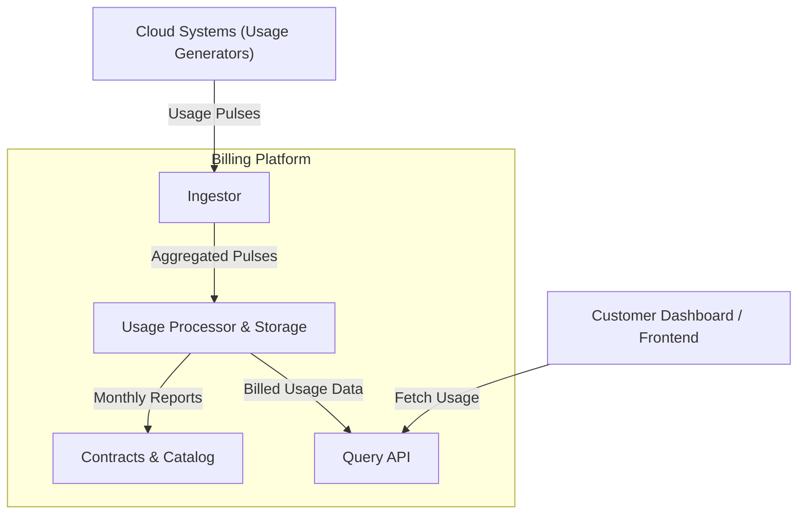
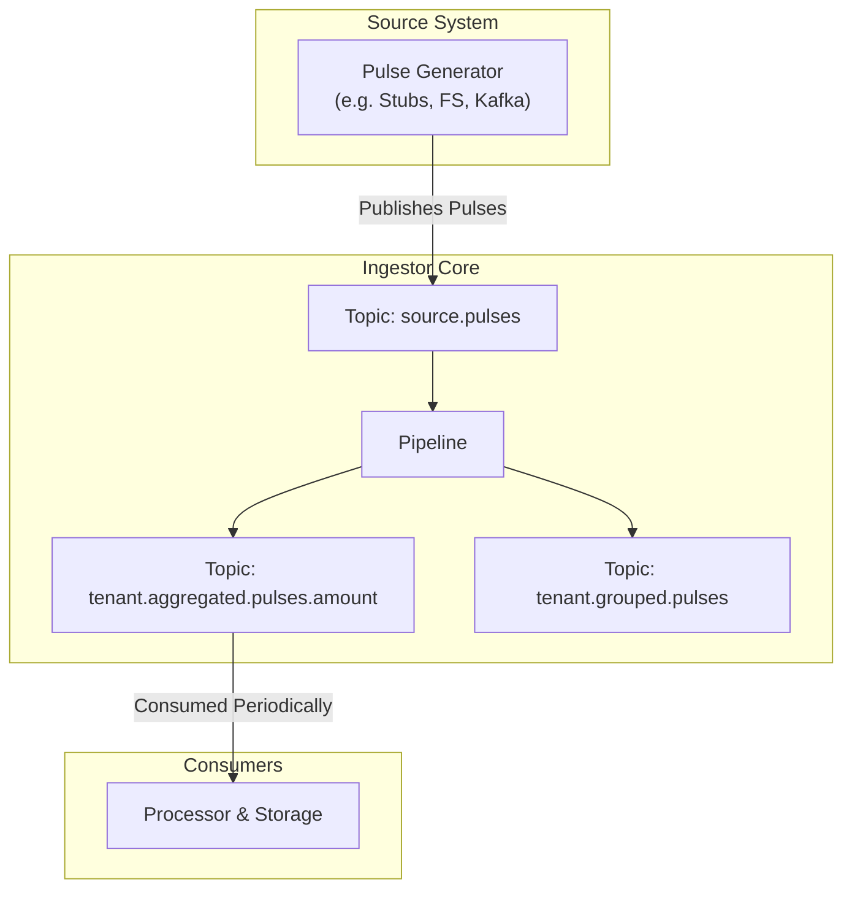

# Pulses — Stream Ingestor for Cloud Usage Events

> A lightweight, modular ingestor designed for aggregating real-time usage pulses in a billing platform.

This repository contains a **standalone, continuously running process** that receives, aggregates, and periodically flushes usage data ("pulses") from cloud services. The architecture is built around **stream processing principles**, allowing for future adoption of distributed systems like **Kafka** or **NATS Streaming**.

The internal structure already supports this evolution through well-defined interfaces, making the project a natural fit for a **Kappa Architecture** approach — where the stream is the single source of truth.

---

## Problem Statement

In cloud platforms, every user action (e.g., storing files, running instances, transferring data) must be tracked and billed. These actions are captured as **pulses** — small units of consumption that identify:

- the **tenant** (who used it),
- the **SKU** (what was used),
- the **used amount**,
- and the **metric unit** (e.g., "GB", "GB·min").

The **Ingestor** is responsible for:

- Continuously receiving these pulses from a source system;
- Aggregating them by `(tenant, SKU, unit)`;
- Periodically **flushing the aggregated data** to downstream processors for pricing and storage.

---

## Architecture

This project follows the [C4 model](https://c4model.com) for software architecture, with the Ingestor acting as the initial stage of a broader **cloud usage billing pipeline**.

> ❗ The Ingestor does **not** handle pricing, contracts, or SKU authorization. These responsibilities are delegated to downstream services.

### System Context



### Data Flow



## Project Structure

````bash
.
├── cmd/ # Ingestor entrypoint
├── internal/
│ ├── app/ # Application orchestration
│ ├── broker/ # I/O connectors (FS, Kafka, NATS)
│ ├── models/ # Domain models (pulses)
│ └── stream/ # Pipeline, aggregation logic, sinks
└── test/ # Integration tests


## Getting Started with Devbox

To simplify the developer setup process, we use [Devbox](https://www.jetpack.io/devbox/). Follow these steps to get started:

1. Install Devbox by following the [installation guide](https://www.jetpack.io/devbox/docs/install/).
2. Clone the repository:
   ```bash
   git clone https://github.com/your-username/pulses.git
   cd pulses
````

3. Start the Devbox environment:
   ```bash
   devbox shell
   ```
4. Install project dependencies:
   ```bash
   devbox install
   ```

You're now ready to start developing!

## Command-Line Options

You can customize the behavior of the Ingestor using the following flags:

| Flag             | Type     | Default           | Description                                                                     |
| ---------------- | -------- | ----------------- | ------------------------------------------------------------------------------- |
| `--port`         | `int`    | `9000`            | Port on which the internal file-system broker will run. Used for local testing. |
| `--source-topic` | `string` | `"source.pulses"` | Logical topic name where input pulses are published.                            |
| `--stub`         | `bool`   | `false`           | Enables stub mode. When enabled, the system generates synthetic pulses.         |
| `--stub-tenants` | `int`    | `10`              | Number of tenants to simulate in stub mode.                                     |
| `--stub-skus`    | `int`    | `50`              | Number of SKUs to simulate in stub mode.                                        |
| `--stub-clean`   | `bool`   | `false`           | Cleans all topics before writing new stub data. Useful for fresh runs.          |

### 🧪 Example Usage

Start the Ingestor with 5 tenants and 20 SKUs (randomly generated) in stub mode:

```bash
go run ./cmd/ingestor \
  --stub \
  --stub-tenants=5 \
  --stub-skus=20 \
  --stub-clean
```

## Documentation

We use [gomarkdoc](https://github.com/princjef/gomarkdoc) to generate and embed Go documentation directly into this README. The documentation includes both exported and unexported symbols for comprehensive coverage.

### Generating Documentation

To generate and embed documentation into this README, run:

```bash
just docs
```

---

<!-- gomarkdoc:embed:start -->

<!-- Code generated by gomarkdoc. DO NOT EDIT -->

# ingestor

```go
import "goriok/pulses/cmd/ingestor"
```

## Index

- [func main\(\)](#main)

<a name="main"></a>
<<<<<<< HEAD

## func [main](https://github.com/goriok/pulses/blob/main/cmd/ingestor/main.go#L13)

=======

## func [main](https://github.com/goriok/pulses/blob/main/cmd/ingestor/main.go#L22)

> > > > > > > f942e38 (feat: update README)

```go
func main()
```

# stubs

```go
import "goriok/pulses/cmd/stubs"
```

## Index

- [Constants](#constants)
- [func CleanTopics\(\)](#CleanTopics)
- [func WriteRandomTenantPulses\(brokerHost string, sourceTopic string, tenantsAmount int, skuAmount int\) error](#WriteRandomTenantPulses)
- [func generateRandomTenants\(amount int\) \[\]string](#generateRandomTenants)
- [func setupStub\(\) error](#setupStub)
- [type SKU](#SKU)
  - [func generateRandomSKU\(amount int\) \[\]\*SKU](#generateRandomSKU)

## Constants

<a name="DATA_DIR"></a>

```go
const (
    DATA_DIR = ".data"
)
```

<a name="CleanTopics"></a>

## func [CleanTopics](https://github.com/goriok/pulses/blob/main/cmd/stubs/main.go#L75)

```go
func CleanTopics()
```

<a name="WriteRandomTenantPulses"></a>

## func [WriteRandomTenantPulses](https://github.com/goriok/pulses/blob/main/cmd/stubs/main.go#L25)

```go
func WriteRandomTenantPulses(brokerHost string, sourceTopic string, tenantsAmount int, skuAmount int) error
```

<a name="generateRandomTenants"></a>

## func [generateRandomTenants](https://github.com/goriok/pulses/blob/main/cmd/stubs/main.go#L95)

```go
func generateRandomTenants(amount int) []string
```

<a name="setupStub"></a>

## func [setupStub](https://github.com/goriok/pulses/blob/main/cmd/stubs/main.go#L58)

```go
func setupStub() error
```

<a name="SKU"></a>

## type [SKU](https://github.com/goriok/pulses/blob/main/cmd/stubs/main.go#L20-L23)

```go
type SKU struct {
    Id      string
    UseUnit string
}
```

<a name="generateRandomSKU"></a>

### func [generateRandomSKU](https://github.com/goriok/pulses/blob/main/cmd/stubs/main.go#L83)

```go
func generateRandomSKU(amount int) []*SKU
```

# ingestor

```go
import "goriok/pulses/internal/app/ingestor"
```

Package ingestor provides the entry point for configuring and starting the stream processing pipeline.

It wires together a source connector, a sink connector, and the pipeline that orchestrates message flow between them, using a filesystem\-backed broker and Kappa\-style architecture for processing.

## Index

- [type App](#App)
  - [func New\(cfg Config\) \*App](#New)
  - [func \(a \*App\) Start\(\) error](#App.Start)
  - [func \(a \*App\) Stop\(\)](#App.Stop)
- [type Config](#Config)
- [type Pipeline](#Pipeline)
- [type SinkConnector](#SinkConnector)
- [type SourceConnector](#SourceConnector)

<a name="App"></a>

## type [App](https://github.com/goriok/pulses/blob/main/internal/app/ingestor/app.go#L39-L44)

```go
type App struct {
    cfg             Config
    sinkConnector   SinkConnector
    sourceConnector SourceConnector
    pipeline        Pipeline
}
```

<a name="New"></a>

### func [New](https://github.com/goriok/pulses/blob/main/internal/app/ingestor/app.go#L46)

```go
func New(cfg Config) *App
```

<a name="App.Start"></a>

### func \(\*App\) [Start](https://github.com/goriok/pulses/blob/main/internal/app/ingestor/app.go#L57)

```go
func (a *App) Start() error
```

<a name="App.Stop"></a>

### func \(\*App\) [Stop](https://github.com/goriok/pulses/blob/main/internal/app/ingestor/app.go#L70)

```go
func (a *App) Stop()
```

<a name="Config"></a>

## type [Config](https://github.com/goriok/pulses/blob/main/internal/app/ingestor/app.go#L30-L37)

```go
type Config struct {
    BrokerPort  int
    SourceTopic string
    EnableStubs bool
    StubTenants int
    StubSKUs    int
    StubClean   bool
}
```

<a name="Pipeline"></a>

## type [Pipeline](https://github.com/goriok/pulses/blob/main/internal/app/ingestor/app.go#L15-L17)

```go
type Pipeline interface {
    Start(opts *stream.Options) error
}
```

<a name="SinkConnector"></a>

## type [SinkConnector](https://github.com/goriok/pulses/blob/main/internal/app/ingestor/app.go#L24-L28)

```go
type SinkConnector interface {
    Connect(topic string) error
    Write(topic string, message []byte) error
    Close()
}
```

<a name="SourceConnector"></a>

## type [SourceConnector](https://github.com/goriok/pulses/blob/main/internal/app/ingestor/app.go#L19-L22)

```go
type SourceConnector interface {
    Read(topic string, handler func(topic string, message []byte)) error
    Close()
}
```

# fsbroker

```go
import "goriok/pulses/internal/broker/fsbroker"
```

Package fsbroker implements a lightweight, filesystem\-backed message broker for local development and testing. It simulates publish/subscribe behavior using TCP connections and disk\-based topic storage in the \`.data\` directory.

## Index

- [Constants](#constants)
- [func ensureDataDirExists\(\) error](#ensureDataDirExists)
- [type Broker](#Broker)
  - [func NewBroker\(port int\) \*Broker](#NewBroker)
  - [func \(b \*Broker\) Host\(\) string](#Broker.Host)
  - [func \(b \*Broker\) On\(\) bool](#Broker.On)
  - [func \(b \*Broker\) Start\(\) error](#Broker.Start)
  - [func \(b \*Broker\) Stop\(\)](#Broker.Stop)
  - [func \(b \*Broker\) broadcastMessages\(\)](#Broker.broadcastMessages)
  - [func \(b \*Broker\) handleConnection\(conn \*net.Conn\)](#Broker.handleConnection)
  - [func \(b \*Broker\) handleSinkConnector\(reader \*bufio.Reader, topic string\)](#Broker.handleSinkConnector)
  - [func \(b \*Broker\) handleSourceConnector\(conn \*net.Conn, topic string\)](#Broker.handleSourceConnector)
- [type SinkConnector](#SinkConnector)
  - [func NewSinkConnector\(broker string\) \*SinkConnector](#NewSinkConnector)
  - [func \(p \*SinkConnector\) Close\(\)](#SinkConnector.Close)
  - [func \(p \*SinkConnector\) Connect\(topic string\) error](#SinkConnector.Connect)
  - [func \(p \*SinkConnector\) Write\(topic string, msg \[\]byte\) error](#SinkConnector.Write)
- [type SourceConnector](#SourceConnector)
  - [func NewSourceConnector\(broker string\) \*SourceConnector](#NewSourceConnector)
  - [func \(c \*SourceConnector\) Close\(\)](#SourceConnector.Close)
  - [func \(c \*SourceConnector\) Read\(topic string, handler func\(topic string, msg \[\]byte\)\) error](#SourceConnector.Read)

## Constants

<a name="DATA_DIR"></a>

```go
const (
    DATA_DIR = ".data"
)
```

<a name="ensureDataDirExists"></a>

## func [ensureDataDirExists](https://github.com/goriok/pulses/blob/main/internal/broker/fsbroker/broker.go#L192)

```go
func ensureDataDirExists() error
```

<a name="Broker"></a>

## type [Broker](https://github.com/goriok/pulses/blob/main/internal/broker/fsbroker/broker.go#L24-L33)

Broker is a local TCP server that simulates a pub/sub broker. It stores messages per topic as files in the .data directory, and manages connected source and sink connectors.

```go
type Broker struct {
    sourceConnectors map[string][]*net.Conn
    newMessage       chan struct {
        Topic   string
        Message string
    }
    mu       sync.Mutex
    host     string
    listener *net.Listener
}
```

<a name="NewBroker"></a>

### func [NewBroker](https://github.com/goriok/pulses/blob/main/internal/broker/fsbroker/broker.go#L35)

```go
func NewBroker(port int) *Broker
```

<a name="Broker.Host"></a>

### func \(\*Broker\) [Host](https://github.com/goriok/pulses/blob/main/internal/broker/fsbroker/broker.go#L85)

```go
func (b *Broker) Host() string
```

<a name="Broker.On"></a>

### func \(\*Broker\) [On](https://github.com/goriok/pulses/blob/main/internal/broker/fsbroker/broker.go#L48)

```go
func (b *Broker) On() bool
```

<a name="Broker.Start"></a>

### func \(\*Broker\) [Start](https://github.com/goriok/pulses/blob/main/internal/broker/fsbroker/broker.go#L54)

```go
func (b *Broker) Start() error
```

Start begins accepting TCP connections from clients. It listens for both sink and source connectors and handles broadcasting.

<a name="Broker.Stop"></a>

### func \(\*Broker\) [Stop](https://github.com/goriok/pulses/blob/main/internal/broker/fsbroker/broker.go#L79)

```go
func (b *Broker) Stop()
```

<a name="Broker.broadcastMessages"></a>

### func \(\*Broker\) [broadcastMessages](https://github.com/goriok/pulses/blob/main/internal/broker/fsbroker/broker.go#L179)

```go
func (b *Broker) broadcastMessages()
```

broadcastMessages delivers new messages to all source connectors subscribed to the topic.

<a name="Broker.handleConnection"></a>

### func \(\*Broker\) [handleConnection](https://github.com/goriok/pulses/blob/main/internal/broker/fsbroker/broker.go#L91)

```go
func (b *Broker) handleConnection(conn *net.Conn)
```

handleConnection receives the initial greeting from a connector to determine whether it is a sink or source, and delegates to the appropriate handler.

<a name="Broker.handleSinkConnector"></a>

### func \(\*Broker\) [handleSinkConnector](https://github.com/goriok/pulses/blob/main/internal/broker/fsbroker/broker.go#L112)

```go
func (b *Broker) handleSinkConnector(reader *bufio.Reader, topic string)
```

handleSinkConnector reads messages from a sink connector and appends them to disk. It then broadcasts the message to all connected source connectors for that topic.

<a name="Broker.handleSourceConnector"></a>

### func \(\*Broker\) [handleSourceConnector](https://github.com/goriok/pulses/blob/main/internal/broker/fsbroker/broker.go#L149)

```go
func (b *Broker) handleSourceConnector(conn *net.Conn, topic string)
```

handleSourceConnector registers a source connector to a topic and replays existing messages. It will remain open indefinitely, receiving messages via broadcast.

<a name="SinkConnector"></a>

## type [SinkConnector](https://github.com/goriok/pulses/blob/main/internal/broker/fsbroker/sink_connector.go#L15-L20)

SinkConnector provides an interface for writing messages to a specific topic on a filesystem\-backed broker via TCP. It includes connection caching and expiration.

```go
type SinkConnector struct {
    broker     string
    mu         sync.Mutex
    cache      map[string]*net.Conn
    expiration map[string]time.Time
}
```

<a name="NewSinkConnector"></a>

### func [NewSinkConnector](https://github.com/goriok/pulses/blob/main/internal/broker/fsbroker/sink_connector.go#L24)

```go
func NewSinkConnector(broker string) *SinkConnector
```

SinkConnector manages outbound TCP connections to broker topics and publishes messages by writing to a topic\-specific stream.

<a name="SinkConnector.Close"></a>

### func \(\*SinkConnector\) [Close](https://github.com/goriok/pulses/blob/main/internal/broker/fsbroker/sink_connector.go#L66)

```go
func (p *SinkConnector) Close()
```

<a name="SinkConnector.Connect"></a>

### func \(\*SinkConnector\) [Connect](https://github.com/goriok/pulses/blob/main/internal/broker/fsbroker/sink_connector.go#L37)

```go
func (p *SinkConnector) Connect(topic string) error
```

Connect establishes or reuses a TCP connection to the specified topic.

Connections are cached per topic and automatically expire after 5 minutes. If a valid connection already exists, it is reused.

<a name="SinkConnector.Write"></a>

### func \(\*SinkConnector\) [Write](https://github.com/goriok/pulses/blob/main/internal/broker/fsbroker/sink_connector.go#L76)

```go
func (p *SinkConnector) Write(topic string, msg []byte) error
```

<a name="SourceConnector"></a>

## type [SourceConnector](https://github.com/goriok/pulses/blob/main/internal/broker/fsbroker/source_connector.go#L11-L14)

```go
type SourceConnector struct {
    broker string
    conn   *net.Conn
}
```

<a name="NewSourceConnector"></a>

### func [NewSourceConnector](https://github.com/goriok/pulses/blob/main/internal/broker/fsbroker/source_connector.go#L16)

```go
func NewSourceConnector(broker string) *SourceConnector
```

<a name="SourceConnector.Close"></a>

### func \(\*SourceConnector\) [Close](https://github.com/goriok/pulses/blob/main/internal/broker/fsbroker/source_connector.go#L51)

```go
func (c *SourceConnector) Close()
```

<a name="SourceConnector.Read"></a>

### func \(\*SourceConnector\) [Read](https://github.com/goriok/pulses/blob/main/internal/broker/fsbroker/source_connector.go#L27)

```go
func (c *SourceConnector) Read(topic string, handler func(topic string, msg []byte)) error
```

Read connects to the broker and subscribes to the given topic.

It invokes the provided handler for every message received from the broker. This function blocks indefinitely unless an error occurs.

# models

```go
import "goriok/pulses/internal/models"
```

## Index

- [type Pulse](#Pulse)

<a name="Pulse"></a>

## type [Pulse](https://github.com/goriok/pulses/blob/main/internal/models/pulse.go#L3-L8)

```go
type Pulse struct {
    TenantID    string  `json:"tenant_id"`
    ProductSKU  string  `json:"product_sku"`
    UsedAmmount float64 `json:"used_ammount"`
    UseUnity    string  `json:"use_unity"`
}
```

# stream

```go
import "goriok/pulses/internal/stream"
```

Package stream implements the core processing pipeline for routing, transforming, and aggregating messages from a source stream.

It wires together connectors, sinks, and aggregation engines to produce grouped and aggregated outputs in a Kappa\-like stream model.

## Index

- [type Options](#Options)
- [type Pipeline](#Pipeline)
  - [func NewPipeline\(\) \*Pipeline](#NewPipeline)
  - [func \(p \*Pipeline\) Start\(opts \*Options\) error](#Pipeline.Start)
- [type SinkConnector](#SinkConnector)
- [type SourceConnector](#SourceConnector)

<a name="Options"></a>

## type [Options](https://github.com/goriok/pulses/blob/main/internal/stream/pipeline.go#L30-L34)

```go
type Options struct {
    SourceTopic     string
    SourceConnector SourceConnector
    SinkConnector   SinkConnector
}
```

<a name="Pipeline"></a>

## type [Pipeline](https://github.com/goriok/pulses/blob/main/internal/stream/pipeline.go#L36)

```go
type Pipeline struct{}
```

<a name="NewPipeline"></a>

### func [NewPipeline](https://github.com/goriok/pulses/blob/main/internal/stream/pipeline.go#L38)

```go
func NewPipeline() *Pipeline
```

<a name="Pipeline.Start"></a>

### func \(\*Pipeline\) [Start](https://github.com/goriok/pulses/blob/main/internal/stream/pipeline.go#L48)

```go
func (p *Pipeline) Start(opts *Options) error
```

Start launches the pipeline with the provided options. It reads from the source topic, emits grouped events per tenant, and applies a memory\-based aggregation for each \(tenant_id, product_sku\) pair.

Grouped messages are enriched with object IDs and timestamps, and both grouped and aggregated results are written to the appropriate sinks.

<a name="SinkConnector"></a>

## type [SinkConnector](https://github.com/goriok/pulses/blob/main/internal/stream/pipeline.go#L25-L28)

```go
type SinkConnector interface {
    Connect(topic string) error
    Write(topic string, message []byte) error
}
```

<a name="SourceConnector"></a>

## type [SourceConnector](https://github.com/goriok/pulses/blob/main/internal/stream/pipeline.go#L21-L23)

```go
type SourceConnector interface {
    Read(topic string, handler func(topic string, message []byte)) error
}
```

# aggregators

```go
import "goriok/pulses/internal/stream/aggregators"
```

## Index

- [func TenantSKUAmount\(event any\) float64](#TenantSKUAmount)
- [func TenantSKUInfo\(key, window string, total float64\) \(map\[string\]any, string, error\)](#TenantSKUInfo)
- [func TenantSKUKey\(event any\) string](#TenantSKUKey)
- [func parseTenantSKUKey\(key string\) \(\*models.Pulse, error\)](#parseTenantSKUKey)

<a name="TenantSKUAmount"></a>

## func [TenantSKUAmount](https://github.com/goriok/pulses/blob/main/internal/stream/aggregators/tenant_sku_amount.go#L37)

```go
func TenantSKUAmount(event any) float64
```

<a name="TenantSKUInfo"></a>

## func [TenantSKUInfo](https://github.com/goriok/pulses/blob/main/internal/stream/aggregators/tenant_sku_amount.go#L10)

```go
func TenantSKUInfo(key, window string, total float64) (map[string]any, string, error)
```

<a name="TenantSKUKey"></a>

## func [TenantSKUKey](https://github.com/goriok/pulses/blob/main/internal/stream/aggregators/tenant_sku_amount.go#L29)

```go
func TenantSKUKey(event any) string
```

<a name="parseTenantSKUKey"></a>

## func [parseTenantSKUKey](https://github.com/goriok/pulses/blob/main/internal/stream/aggregators/tenant_sku_amount.go#L45)

```go
func parseTenantSKUKey(key string) (*models.Pulse, error)
```

# engines

```go
import "goriok/pulses/internal/stream/aggregators/engines"
```

Package engines provides low\-level aggregation strategies for stream processing.

This file defines an in\-memory implementation used for aggregating data within a flush window. It is useful for local development or testing scenarios, and can later be replaced by distributed or persistent alternatives like Redis or Kafka Streams.

## Index

- [type AggregationEntry](#AggregationEntry)
- [type AmountFunc](#AmountFunc)
- [type KeyFunc](#KeyFunc)
- [type MemoryAggregator](#MemoryAggregator)
  - [func NewMemoryAggregator\(keyFn KeyFunc, amountFn AmountFunc, sinkDataFn SinkDataFunc, sink Sink\) \*MemoryAggregator](#NewMemoryAggregator)
  - [func \(a \*MemoryAggregator\) Add\(event any\)](#MemoryAggregator.Add)
  - [func \(a \*MemoryAggregator\) run\(\)](#MemoryAggregator.run)
- [type Sink](#Sink)
- [type SinkDataFunc](#SinkDataFunc)

<a name="AggregationEntry"></a>

## type [AggregationEntry](https://github.com/goriok/pulses/blob/main/internal/stream/aggregators/engines/memory.go#L16-L21)

```go
type AggregationEntry struct {
    Total     float64
    FirstSeen string
    LastSeen  string
    ObjectID  string
}
```

<a name="AmountFunc"></a>

## type [AmountFunc](https://github.com/goriok/pulses/blob/main/internal/stream/aggregators/engines/memory.go#L35)

AmountFunc defines a function that extracts the amount from a generic event.

```go
type AmountFunc func(event any) float64
```

<a name="KeyFunc"></a>

## type [KeyFunc](https://github.com/goriok/pulses/blob/main/internal/stream/aggregators/engines/memory.go#L29)

KeyFunc defines a function that generates a string key from a generic event.

```go
type KeyFunc func(event any) string
```

<a name="MemoryAggregator"></a>

## type [MemoryAggregator](https://github.com/goriok/pulses/blob/main/internal/stream/aggregators/engines/memory.go#L39-L47)

MemoryAggregator aggregates generic events in memory by a dynamic key. It flushes the results every flushEvery arg seconds to the provided Sink.

```go
type MemoryAggregator struct {
    keyFn      KeyFunc
    amountFn   AmountFunc
    buffer     map[string]*AggregationEntry
    flushEvery time.Duration
    sink       Sink
    mu         sync.Mutex
    sincDataFn SinkDataFunc
}
```

<a name="NewMemoryAggregator"></a>

### func [NewMemoryAggregator](https://github.com/goriok/pulses/blob/main/internal/stream/aggregators/engines/memory.go#L51)

```go
func NewMemoryAggregator(keyFn KeyFunc, amountFn AmountFunc, sinkDataFn SinkDataFunc, sink Sink) *MemoryAggregator
```

NewMemoryAggregator creates a new in\-memory aggregator that emits aggregates grouped by a caller\-defined key every 30s.

<a name="MemoryAggregator.Add"></a>

### func \(\*MemoryAggregator\) [Add](https://github.com/goriok/pulses/blob/main/internal/stream/aggregators/engines/memory.go#L65)

```go
func (a *MemoryAggregator) Add(event any)
```

Add processes a new event and updates the in\-memory buffer.

<a name="MemoryAggregator.run"></a>

### func \(\*MemoryAggregator\) [run](https://github.com/goriok/pulses/blob/main/internal/stream/aggregators/engines/memory.go#L82)

```go
func (a *MemoryAggregator) run()
```

run executes the aggregation flushing loop. It periodically drains the current buffer and sends the results to the sink.

<a name="Sink"></a>

## type [Sink](https://github.com/goriok/pulses/blob/main/internal/stream/aggregators/engines/memory.go#L24-L26)

Sink defines an output destination for aggregated results \(e.g. a stream topic\).

```go
type Sink interface {
    Write(topic string, data []byte) error
}
```

<a name="SinkDataFunc"></a>

## type [SinkDataFunc](https://github.com/goriok/pulses/blob/main/internal/stream/aggregators/engines/memory.go#L32)

SinkTopicSuffixFunc defines a function that generates a topic suffix for the sink.

```go
type SinkDataFunc func(key, window string, total float64) (map[string]any, string, error)
```

# sinks

```go
import "goriok/pulses/internal/stream/sinks"
```

## Index

- [type SinkConnector](#SinkConnector)
- [type StreamSink](#StreamSink)
  - [func NewStreamSink\(p SinkConnector\) \*StreamSink](#NewStreamSink)
  - [func \(s \*StreamSink\) Write\(topic string, data \[\]byte\) error](#StreamSink.Write)

<a name="SinkConnector"></a>

## type [SinkConnector](https://github.com/goriok/pulses/blob/main/internal/stream/sinks/stream.go#L3-L6)

```go
type SinkConnector interface {
    Connect(topic string) error
    Write(topic string, message []byte) error
}
```

<a name="StreamSink"></a>

## type [StreamSink](https://github.com/goriok/pulses/blob/main/internal/stream/sinks/stream.go#L8-L10)

```go
type StreamSink struct {
    SinkConnector SinkConnector
}
```

<a name="NewStreamSink"></a>

### func [NewStreamSink](https://github.com/goriok/pulses/blob/main/internal/stream/sinks/stream.go#L12)

```go
func NewStreamSink(p SinkConnector) *StreamSink
```

<a name="StreamSink.Write"></a>

### func \(\*StreamSink\) [Write](https://github.com/goriok/pulses/blob/main/internal/stream/sinks/stream.go#L16)

```go
func (s *StreamSink) Write(topic string, data []byte) error
```

Generated by [gomarkdoc](https://github.com/princjef/gomarkdoc)

<!-- gomarkdoc:embed:end -->
