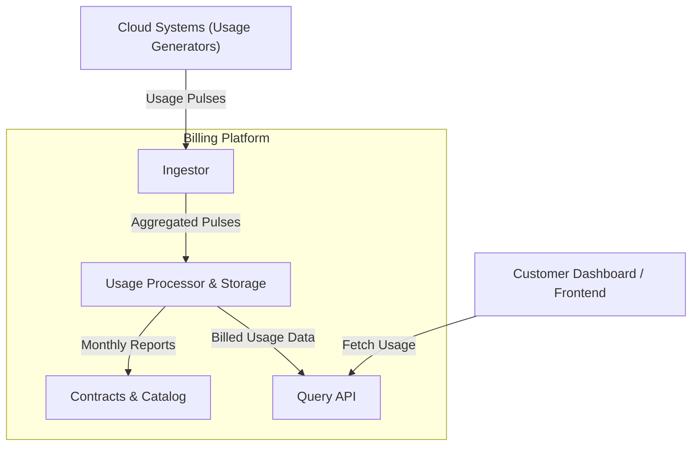
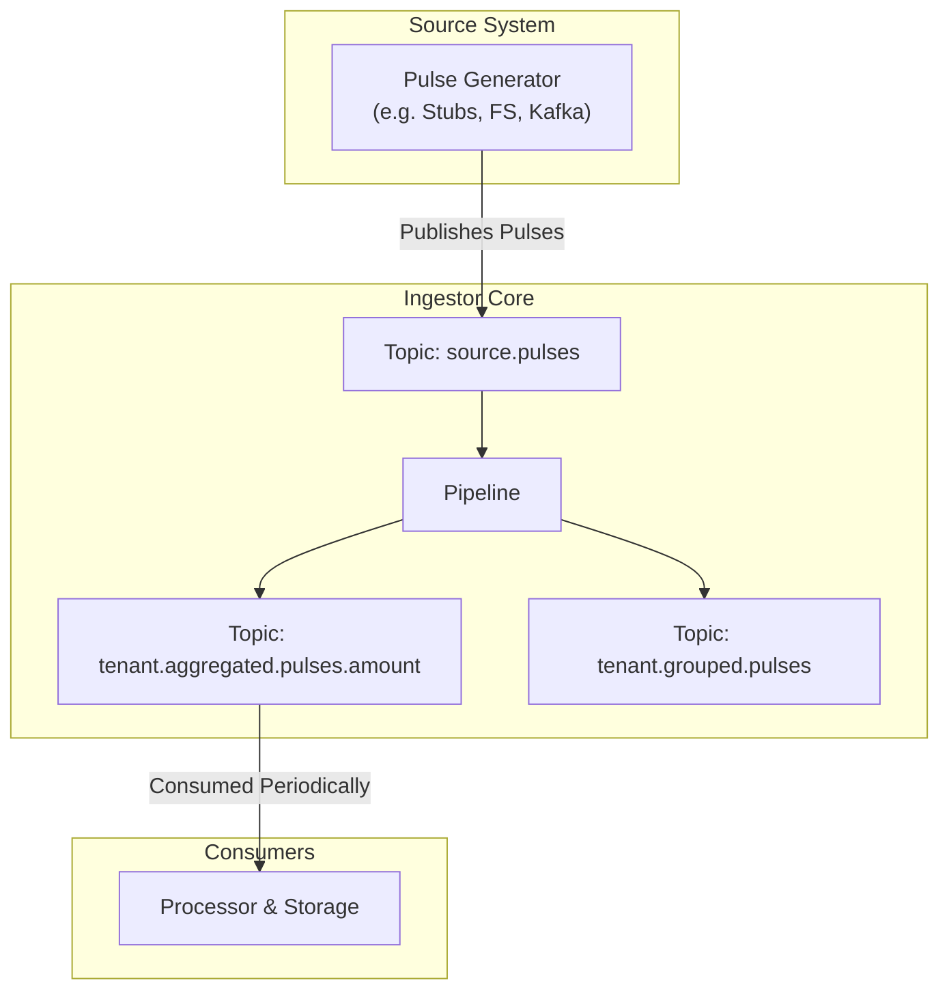

# Pulses — Stream Ingestor for Cloud Usage Events

> A lightweight, modular ingestor designed for aggregating real-time usage pulses in a billing platform.

This repository contains a **standalone, continuously running process** that receives, aggregates, and periodically flushes usage data ("pulses") from cloud services. The architecture is built around **stream processing principles**, allowing for future adoption of distributed systems like **Kafka** or **NATS Streaming**.

The internal structure already supports this evolution through well-defined interfaces, making the project a natural fit for a **Kappa Architecture** approach — where the stream is the single source of truth.

---

## Problem Statement

In cloud platforms, every user action (e.g., storing files, running instances, transferring data) must be tracked and billed. These actions are captured as **pulses** — small units of consumption that identify:

- the **tenant** (who used it),
- the **SKU** (what was used),
- the **used amount**,
- and the **metric unit** (e.g., "GB", "GB·min").

The **Ingestor** is responsible for:

- Continuously receiving these pulses from a source system;
- Aggregating them by `(tenant, SKU, unit)`;
- Periodically **flushing the aggregated data** to downstream processors for pricing and storage.

---

## Architecture

This project follows the [C4 model](https://c4model.com) for software architecture, with the Ingestor acting as the initial stage of a broader **cloud usage billing pipeline**.

> ❗ The Ingestor does **not** handle pricing, contracts, or SKU authorization. These responsibilities are delegated to downstream services.

### System Context



<details> <summary><strong> Accessible Description: System Context C4 Model Diagram</strong></summary>

    Cloud Systems generate usage pulses and send them to the Ingestor.

    The Ingestor aggregates the pulses and forwards them to the Usage Processor & Storage.

    The Processor converts the data into billed usage, which is exposed through the Query API.

    The Frontend Dashboard queries the Query API to fetch usage data for customers.

    The Processor also produces Monthly Reports sent to the Contracts & Catalog, which manages usage plans and contractual logic.

</details>

### Data Flow



<details> <summary><strong>Accessible Description: Ingestor Pipeline Flow</strong></summary>

    A Pulse Generator (like a stub, file system, or Kafka source) produces usage pulses and publishes them to the topic source.pulses.

    The Ingestor Pipeline reads from this source topic.

    It processes the incoming data and writes results to two output topics:

        tenant.aggregated.pulses.amount: used for consumption by the Processor & Storage.

        tenant.grouped.pulses: for other use cases (e.g., grouping or analytics).

    The Processor periodically consumes data from the aggregated.pulses.amount topic for billing and storage.

</details>

## Project Structure

````bash
.
├── cmd/ # Ingestor entrypoint
├── internal/
│ ├── app/ # Application orchestration
│ ├── broker/ # I/O connectors (FS, Kafka, NATS)
│ ├── models/ # Domain models (pulses)
│ └── stream/ # Pipeline, aggregation logic, sinks
└── test/ # Integration tests


## Getting Started with Devbox

To simplify the developer setup process, we use [Devbox](https://www.jetpack.io/devbox/). Follow these steps to get started:

1. Install Devbox by following the [installation guide](https://www.jetpack.io/devbox/docs/install/).
2. Clone the repository:
   ```bash
   git clone https://github.com/your-username/pulses.git
   cd pulses
````

3. Start the Devbox environment:
   ```bash
   devbox shell
   ```
4. Install project dependencies:
   ```bash
   devbox install
   ```

You're now ready to start developing!

## Command-Line Options

You can customize the behavior of the Ingestor using the following flags:

| Flag             | Type     | Default           | Description                                                                     |
| ---------------- | -------- | ----------------- | ------------------------------------------------------------------------------- |
| `--port`         | `int`    | `9000`            | Port on which the internal file-system broker will run. Used for local testing. |
| `--source-topic` | `string` | `"source.pulses"` | Logical topic name where input pulses are published.                            |
| `--stub`         | `bool`   | `false`           | Enables stub mode. When enabled, the system generates synthetic pulses.         |
| `--stub-tenants` | `int`    | `10`              | Number of tenants to simulate in stub mode.                                     |
| `--stub-skus`    | `int`    | `50`              | Number of SKUs to simulate in stub mode.                                        |
| `--stub-clean`   | `bool`   | `false`           | Cleans all topics before writing new stub data. Useful for fresh runs.          |

### 🧪 Example Usage

Start the Ingestor with 5 tenants and 20 SKUs (randomly generated) in stub mode:

```bash
go run ./cmd/ingestor \
  --stub \
  --stub-tenants=5 \
  --stub-skus=20 \
  --stub-clean
```

## NotebookLM

NotebookLM was used to make the information more acessible and to generate the documentation.

Link: https://notebooklm.google.com/notebook/5d30eed7-0819-4a95-a500-62809cb30cb7

## Books / Articles:

- [Architecting Data-Intensive Applications](https://www.oreilly.com/library/view/architecting-data-intensive-applications/9781786465092/)
- [Kappa Architecture 101—Deep Dive into Stream-First Design (2025)](https://www.chaosgenius.io/blog/kappa-architecture/)
- [Questioning-the-lambda-architecture](https://www.oreilly.com/radar/questioning-the-lambda-architecture/)

## Gomarkdocs Documentation

We use [gomarkdoc](https://github.com/princjef/gomarkdoc) to generate and embed Go documentation directly into this README. The documentation includes both exported and unexported symbols for comprehensive coverage.

### Generating Documentation

To generate and embed documentation into this README, run:

```bash
just docs
```

---

<!-- gomarkdoc:embed:start -->

<!-- gomarkdoc:embed:end -->
